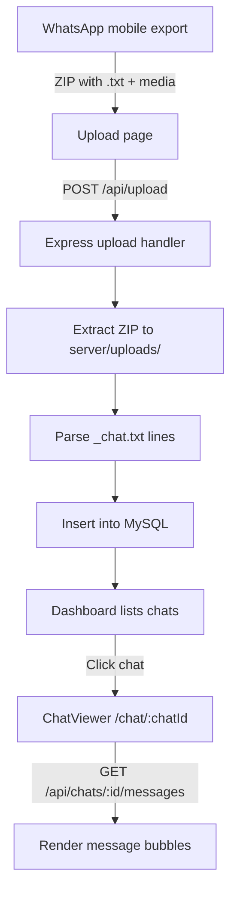

# ChatVault Web

Self-hosted WhatsApp chat viewer with a WhatsApp Web–inspired interface. Users export chats from WhatsApp, upload the ZIP export, and browse conversations in the browser. All data stays on your server.

## Tech Stack

| Layer | Technology |
|-------|------------|
| Frontend | React 18, Vite, Tailwind CSS, React Router |
| Backend | Node.js, Express |
| Database | MySQL 8+ |
| Auth | JWT (Bearer token in `localStorage`) |

---

## Project Structure

```
├── src/                    # React frontend
│   ├── pages/              # Route pages (Landing, Login, Register, …)
│   ├── contexts/           # Auth & theme state
│   └── components/         # Shared UI
├── server/
│   ├── index.js            # Express app entry point
│   ├── routes/
│   │   ├── auth.js         # Register, login, profile
│   │   ├── chats.js        # List chats, messages, search
│   │   └── upload.js       # ZIP upload & parsing
│   ├── config/
│   │   ├── database.js     # MySQL pool & schema init
│   │   └── schema.sql      # Tables: users, chats, messages, chat_participants
│   └── uploads/            # Extracted chat files (created at runtime)
├── vite.config.js          # Dev proxy: /api → :3001
└── package.json
```

---

## How Chats Are Displayed (End-to-End Flow)

### Overview



### 1. Export from WhatsApp

On mobile: **Chat → ⋮ → Export chat → Include media**. WhatsApp produces a ZIP containing:

- A `.txt` file with the conversation log
- Media files (images, videos, audio, documents)

Expected line format (parsed by the server):

```
[DD/MM/YYYY, HH:MM:SS] Sender Name: Message text
```

### 2. Upload & Ingest (`POST /api/upload`)

1. Authenticated user sends a multipart form with field **`chatZip`** (ZIP file, max 500 MB).
2. Server creates `server/uploads/user_{userId}/chat_{timestamp}/` and extracts the archive.
3. The first `.txt` file found is treated as the chat log.
4. **`parseChatFile()`** in `server/routes/upload.js`:
   - Matches each line with regex: `[date, time] sender: content`
   - Skips system lines (encryption notice, group subject changes)
   - Tracks participants and message counts
   - Detects media placeholders (`<Media omitted>`, `image omitted`, etc.) and links them to files in the ZIP
   - Derives chat name: two participants → `"Alice & Bob"`; groups → `"Group Chat (N participants)"`
5. Records are inserted into:
   - **`chats`** — metadata (name, dates, counts, file path)
   - **`chat_participants`** — per-sender stats
   - **`messages`** — sender, content, timestamp, type (`text` | `image` | `video` | `audio` | `document`)

### 3. Dashboard — Chat List (`GET /api/chats`)

The dashboard page (route `/dashboard`) is intended to:

1. Call `GET /api/chats` with the JWT in the `Authorization` header.
2. Receive an array of chats with `participant_count` and `message_count`.
3. Render a list; clicking a row navigates to `/chat/:chatId`.

### 4. Chat Viewer — Message Display (`/chat/:chatId`)

The chat viewer is intended to work as follows:

1. **`GET /api/chats/:chatId`** — chat name, dates, participant list.
2. **`GET /api/chats/:chatId/messages?page=1&limit=50`** — paginated messages ordered by `timestamp ASC`.
   - Optional `search` query filters by content or sender.
3. **UI rendering** (designed in `src/index.css` and Tailwind theme):
   - Chat area uses `.chat-background` (WhatsApp-style wallpaper pattern).
   - Each message uses `.message-bubble.sent` or `.message-bubble.received` depending on whether the sender is the current user.
   - Sent bubbles: green (`#d9fdd3` / dark `#005c4b`), aligned right.
   - Received bubbles: white / dark gray, aligned left, with sender name shown in group chats.
   - Media messages render ``, `<video>`, `<audio>`, or download links using paths under `/uploads/...` (proxied to the Express static handler).
   - Timestamps formatted with `date-fns` (dependency already in `package.json`).

### 5. Search (`GET /api/chats/search/messages?q=...`)

Cross-chat message search returns up to 100 matches with `chat_name` and `chat_id` for navigation.

### Authentication Flow

All chat/upload routes require a valid JWT:

1. Register or login → token stored in `localStorage`.
2. `AuthContext` sets `axios.defaults.headers.common['Authorization']`.
3. `authenticateToken` middleware validates the token on every protected API call.

---

## API Reference (Quick)

| Method | Endpoint | Auth | Description |
|--------|----------|------|-------------|
| POST | `/api/auth/register` | No | Create account |
| POST | `/api/auth/login` | No | Login, receive JWT |
| GET | `/api/auth/me` | Yes | Current user |
| GET | `/api/chats` | Yes | List user's chats |
| GET | `/api/chats/:chatId` | Yes | Chat details + participants |
| GET | `/api/chats/:chatId/messages` | Yes | Paginated messages |
| GET | `/api/chats/search/messages?q=` | Yes | Search messages |
| DELETE | `/api/chats/:chatId` | Yes | Delete chat |
| POST | `/api/upload` | Yes | Upload WhatsApp ZIP (`chatZip` field) |
| GET | `/api/health` | No | Health check |

---

## Local Development

### Prerequisites

- **Node.js** 18+
- **MySQL** 8+ running locally (or remote instance)
- **npm**

### Environment Variables

Create a `.env` file in the project root:

```env
# Server
PORT=3001
NODE_ENV=development

# Database
DB_HOST=localhost
DB_USER=root
DB_PASSWORD=your_mysql_password
DB_NAME=chatvault

# Security (change in production!)
JWT_SECRET=your-long-random-secret-key
```

The database and tables are created automatically on first server start via `server/config/database.js` and `schema.sql`.

### Install & Run

```bash
npm install
npm run dev
```

This starts both processes concurrently:

| Service | URL | Command |
|---------|-----|---------|
| Vite dev server (frontend) | http://localhost:5173 | `npm run client` |
| Express API (backend) | http://localhost:3001 | `npm run server` |

Vite proxies `/api` and `/uploads` to the backend (see `vite.config.js`), so the frontend always talks to `/api/...` on the same origin during development.

### Verify the Backend

```bash
curl http://localhost:3001/api/health
# {"status":"OK","timestamp":"..."}
```

Register and test upload via API:

```bash
# Register
curl -X POST http://localhost:3001/api/auth/register \
  -H "Content-Type: application/json" \
  -d '{"name":"Test User","email":"test@example.com","password":"secret123"}'

# Upload (replace TOKEN and path to your WhatsApp export ZIP)
curl -X POST http://localhost:3001/api/upload \
  -H "Authorization: Bearer TOKEN" \
  -F "chatZip=@/path/to/WhatsApp Chat.zip"

# List chats
curl http://localhost:3001/api/chats \
  -H "Authorization: Bearer TOKEN"

# Fetch messages
curl "http://localhost:3001/api/chats/1/messages?page=1&limit=50" \
  -H "Authorization: Bearer TOKEN"
```

### Windows Note

The upload middleware uses `tempFileDir: '/tmp/'`. On Windows you may need to change this in `server/index.js` to a valid temp path (e.g. `os.tmpdir()`) if uploads fail.

### Known Gap — Missing Frontend Pages

`src/App.jsx` imports four pages that are **not present** in the repository:

- `src/pages/Dashboard.jsx`
- `src/pages/ChatViewer.jsx`
- `src/pages/Upload.jsx`
- `src/pages/Settings.jsx`

Until these are added, `npm run dev` will fail at build time. The **backend API is complete** and can be tested with curl/Postman. The landing, login, and register pages exist and work.

---

## Deployment

### Docker on a VPS (recommended)

For a full production stack (MySQL + API + Nginx) with Docker Compose, see **[docs/VPS-DOCKER-SETUP.md](docs/VPS-DOCKER-SETUP.md)**.

Quick start on a Linux VPS:

```bash
cp .env.docker.example .env   # edit secrets before starting
docker compose up -d --build
```

### Manual production setup

A typical non-Docker production setup:

### 1. Build the Frontend

```bash
npm install
npm run build
```

Output goes to `dist/`.

### 2. Serve Frontend + API Together

Option A — **Nginx reverse proxy** (recommended):

```nginx
server {
    listen 80;
    server_name your-domain.com;

    # React static files
    location / {
        root /var/www/chatvault/dist;
        try_files $uri $uri/ /index.html;
    }

    # API
    location /api/ {
        proxy_pass http://127.0.0.1:3001;
        proxy_http_version 1.1;
        proxy_set_header Host $host;
        proxy_set_header X-Real-IP $remote_addr;
        client_max_body_size 500M;
    }

    # Uploaded media
    location /uploads/ {
        proxy_pass http://127.0.0.1:3001;
    }
}
```

Option B — **Serve `dist/` from Express** by adding to `server/index.js` (production only):

```js
import path from 'path';
// after API routes:
app.use(express.static(path.join(__dirname, '../dist')));
app.get('*', (req, res) => {
  res.sendFile(path.join(__dirname, '../dist/index.html'));
});
```

In production, CORS is disabled (`origin: false` in `server/index.js`), so the frontend and API must share the same origin (via Nginx or Express static serving).

### 3. Run the API with PM2

```bash
npm install -g pm2
NODE_ENV=production pm2 start server/index.js --name chatvault-api
pm2 save
pm2 startup
```

### 4. Production Environment

Set these on the server (never commit real values):

```env
NODE_ENV=production
PORT=3001
DB_HOST=your-db-host
DB_USER=chatvault
DB_PASSWORD=strong-password
DB_NAME=chatvault
JWT_SECRET=long-random-secret-at-least-32-chars
```

### 5. MySQL

- Create a dedicated MySQL user with access only to the `chatvault` database.
- Enable regular backups (chats and messages are in MySQL; media files are on disk under `server/uploads/`).
- Ensure `server/uploads/` is on persistent storage with enough space for ZIP extractions.

### 6. HTTPS

Terminate TLS at Nginx or a load balancer (Let's Encrypt / Certbot). WhatsApp exports can be sensitive — always use HTTPS in production.

### 7. Security Checklist

- [ ] Change `JWT_SECRET` from the default
- [ ] Use strong MySQL credentials
- [ ] Restrict database port to localhost
- [ ] Set `client_max_body_size` for large ZIP uploads
- [ ] Keep Node.js and dependencies updated
- [ ] Back up `server/uploads/` and the MySQL database

---

## Database Schema (Summary)

| Table | Purpose |
|-------|---------|
| `users` | Accounts (email, bcrypt password hash) |
| `chats` | One row per uploaded export |
| `messages` | Individual messages with optional media metadata |
| `chat_participants` | Sender names and per-participant stats |

Foreign keys cascade on delete: removing a chat removes its messages and participants.

---

## Scripts

| Command | Description |
|---------|-------------|
| `npm run dev` | Start API + Vite dev server |
| `npm run server` | API only (nodemon) |
| `npm run client` | Vite dev server only |
| `npm run build` | Production frontend build |
| `npm run preview` | Preview production build locally |

---

## License

Private / self-hosted use. Adjust licensing as needed for your deployment.
