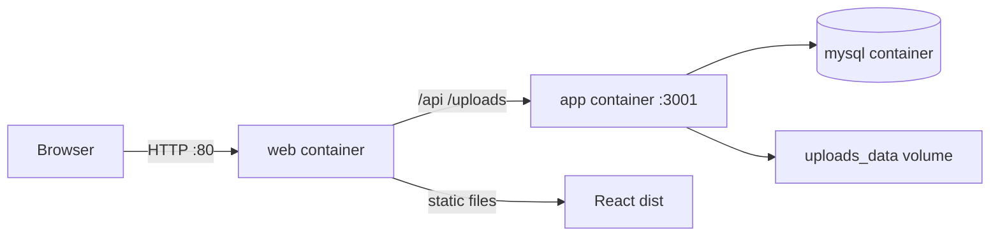

# ChatVault — VPS Docker Deployment

> **Quick start:** For a simple step-by-step checklist (IP + port, multi-app server), see [VPS-SETUP-CHECKLIST.md](./VPS-SETUP-CHECKLIST.md).

Deploy **ChatVault Web** on a Linux VPS using Docker Compose. The stack runs three containers:

| Service | Role |
|---------|------|
| **mysql** | MySQL 8.4 database (persistent volume) |
| **app** | Node.js / Express API on port 3001 (internal) |
| **web** | Nginx serving the React build and proxying `/api` and `/uploads` |

Uploaded WhatsApp exports and extracted media are stored in a Docker volume (`uploads_data`).

---

## Requirements

### VPS

- Ubuntu 22.04 / 24.04 LTS (or any Linux with Docker support)
- Minimum **2 GB RAM**, **2 vCPU**, **20 GB disk** (more if storing many chat exports)
- A domain name pointing to the VPS public IP (recommended for HTTPS)

### Software on the VPS

- [Docker Engine](https://docs.docker.com/engine/install/) 24+
- [Docker Compose plugin](https://docs.docker.com/compose/install/) v2+

Quick install as **root** (e.g. `root@vmi3356488:~#`):

```bash
curl -fsSL https://get.docker.com | sh
docker --version
docker compose version
```

> For a full copy-paste walkthrough (root, `/opt/apps/chatvault`, port **8080**), use [VPS-SETUP-CHECKLIST.md](./VPS-SETUP-CHECKLIST.md).

### Firewall

For IP + port access (recommended when hosting multiple apps on one VPS):

```bash
ufw allow OpenSSH
ufw allow 8080/tcp
ufw enable
```

Set `HTTP_PORT=8080` in `.env`. Access: `http://YOUR_VPS_IP:8080`.

For domain on port 80 later:

```bash
ufw allow 80/tcp
ufw allow 443/tcp
```

---

## Architecture



All services communicate on an internal Docker network. Only the **web** container exposes port 80 (configurable via `HTTP_PORT`).

---

## Quick Start

Exact steps for **root** on the VPS are in [VPS-SETUP-CHECKLIST.md](./VPS-SETUP-CHECKLIST.md). Summary:

### 1. App directory

```bash
mkdir -p /opt/apps/chatvault
cd /opt/apps/chatvault
```

Clone or upload the full project into this folder.

### 2. Configure environment (database is auto-created)

```bash
cp .env.docker.example .env
openssl rand -base64 48
nano .env
```

No manual MySQL install or `CREATE DATABASE` is required. On first `docker compose up`, the **mysql** container creates `DB_NAME` and `DB_USER` from `.env`; the **app** container runs `schema.sql` to create tables.

If passwords contain `#` or `$`, wrap them in double quotes in `.env` (otherwise `#` starts a comment).

**Required changes** before going live:

| Variable | Description |
|----------|-------------|
| `JWT_SECRET` | Output of `openssl rand -base64 48` |
| `DB_PASSWORD` | Strong password for the `chatvault` MySQL user |
| `MYSQL_ROOT_PASSWORD` | Strong root password for MySQL |
| `HTTP_PORT` | **`8080`** for IP:port access (leaves port 80 free) |

Example:

```env
NODE_ENV=production
PORT=3001

DB_HOST=mysql
DB_USER=chatvault
DB_PASSWORD=YourStrongDbPassword123!
DB_NAME=chatvault
MYSQL_ROOT_PASSWORD=YourStrongRootPassword456!

JWT_SECRET=paste-output-of-openssl-rand-base64-48-here

HTTP_PORT=8080
```

> **Note:** `DB_HOST` must stay `mysql` — that is the Docker Compose service name, not `localhost`.

### 3. Build and start

```bash
cd /opt/apps/chatvault
docker compose up -d --build
```

First run takes a few minutes (npm install + Vite build inside the image).

### 4. Verify

```bash
docker compose ps
curl http://localhost:8080/api/health
# {"status":"OK","timestamp":"..."}

docker compose logs -f app
docker compose logs -f web
docker compose logs -f mysql
```

Open `http://YOUR_VPS_IP:8080` in a browser. Register an account and upload a WhatsApp export ZIP.

---

## File Reference

| File | Purpose |
|------|---------|
| `docker-compose.yml` | Orchestrates mysql, app, and web services |
| `Dockerfile` | Production Node.js API image |
| `Dockerfile.web` | Builds React frontend + Nginx image |
| `docker/nginx.conf` | Nginx reverse proxy and SPA routing |
| `.env.docker.example` | Template for production `.env` |
| `.dockerignore` | Keeps build context small |

---

## Common Operations

### Stop / start

```bash
docker compose down          # stop containers (data volumes kept)
docker compose up -d         # start again
docker compose restart app   # restart API only
```

### Update to a new version

```bash
git pull
docker compose up -d --build
```

### Shell access

```bash
docker compose exec app sh
docker compose exec mysql mysql -u chatvault -p chatvault
```

### View disk usage

```bash
docker system df
docker volume ls
```

---

## HTTPS with Let's Encrypt (Certbot)

WhatsApp exports contain private conversations — **always use HTTPS in production**.

### Option A — Certbot on the host (simple)

1. Stop the web container temporarily so Certbot can bind port 80:

   ```bash
   docker compose stop web
   ```

2. Install Certbot and obtain a certificate:

   ```bash
   sudo apt install certbot
   sudo certbot certonly --standalone -d your-domain.com
   ```

3. Mount certificates into Nginx. Create `docker/nginx-ssl.conf` based on `docker/nginx.conf`, adding:

   ```nginx
   listen 443 ssl;
   ssl_certificate     /etc/letsencrypt/live/your-domain.com/fullchain.pem;
   ssl_certificate_key /etc/letsencrypt/live/your-domain.com/privkey.pem;
   ```

4. Update `docker-compose.yml` under **web** → `ports` and `volumes`:

   ```yaml
   web:
     ports:
       - "80:80"
       - "443:443"
     volumes:
       - /etc/letsencrypt:/etc/letsencrypt:ro
   ```

5. Rebuild/restart web with the SSL config mounted, then renew via cron:

   ```bash
   0 3 * * * certbot renew --quiet && docker compose restart web
   ```

### Option B — Reverse proxy in front (recommended for multiple apps)

Run **Caddy** or **Traefik** on the host (or in its own container) to terminate TLS and forward to `localhost:80`. Leave ChatVault on HTTP internally; the edge proxy handles HTTPS.

---

## Backups

Back up both the database and uploaded files.

### Database dump

```bash
docker compose exec mysql mysqldump -u root -p"${MYSQL_ROOT_PASSWORD}" chatvault \
  > chatvault-backup-$(date +%F).sql
```

Restore:

```bash
docker compose exec -T mysql mysql -u root -p"${MYSQL_ROOT_PASSWORD}" chatvault \
  < chatvault-backup-2026-06-08.sql
```

### Upload volume

```bash
docker run --rm \
  -v chatvault_uploads_data:/data \
  -v $(pwd):/backup \
  alpine tar czf /backup/uploads-backup-$(date +%F).tar.gz -C /data .
```

Replace `chatvault_uploads_data` with the actual volume name from `docker volume ls` (Compose prefixes the project folder name).

---

## Troubleshooting

### App exits with "Database initialization failed"

- MySQL may still be starting. Check: `docker compose logs mysql`
- Verify `.env` credentials match `MYSQL_USER`, `MYSQL_PASSWORD`, and `MYSQL_ROOT_PASSWORD`
- Wait for the healthcheck: `docker compose ps` should show mysql as **healthy**

### Upload fails or times out

- Nginx `client_max_body_size` is set to **500M** in `docker/nginx.conf`
- Ensure the VPS has enough free disk space for ZIP extraction under the uploads volume

### 502 Bad Gateway on `/api/*`

- API container may be down: `docker compose logs app`
- Confirm app is on the network: `docker compose exec web wget -qO- http://app:3001/api/health`

### Frontend build fails during `docker compose build`

- Ensure all frontend pages referenced in `src/App.jsx` exist (see main [README](../README.md))
- Build locally first to see errors: `npm install && npm run build`

### Cannot connect from browser

- Check firewall: `sudo ufw status`
- Confirm port mapping: `docker compose ps` → web should show `0.0.0.0:80->80/tcp`
- If using a cloud provider, open port 80 in the security group / firewall rules

---

## Production Checklist

- [ ] Changed `JWT_SECRET`, `DB_PASSWORD`, and `MYSQL_ROOT_PASSWORD` from defaults
- [ ] Enabled HTTPS (Certbot or reverse proxy)
- [ ] Configured automated MySQL and uploads backups
- [ ] Restricted SSH (key-only login, non-default port optional)
- [ ] Set up log rotation or monitoring (`docker compose logs`)
- [ ] Verified health endpoint: `curl https://your-domain.com/api/health`
- [ ] Tested ZIP upload end-to-end with a real WhatsApp export

---

## Resource tuning

For a small self-hosted instance, default Compose settings are usually enough. If you expect heavy use:

- Increase MySQL `innodb_buffer_pool_size` via a custom `my.cnf` mounted into the mysql service
- Scale vertically (more RAM) before running multiple app replicas — uploads use local disk volumes
- Monitor volume growth under `uploads_data`; WhatsApp exports with media can be large

---

## Uninstall

```bash
docker compose down -v   # WARNING: -v deletes mysql_data and uploads_data volumes
```

Remove images if no longer needed:

```bash
docker compose down -v --rmi all
```

---

## Related docs

- [VPS-SETUP-CHECKLIST.md](./VPS-SETUP-CHECKLIST.md) — simple todo checklist for IP:port access and multi-app VPS layout
- [Main README](../README.md) — development setup, API reference, architecture
- [Docker Compose reference](https://docs.docker.com/compose/)
- [Docker Engine install](https://docs.docker.com/engine/install/ubuntu/)
